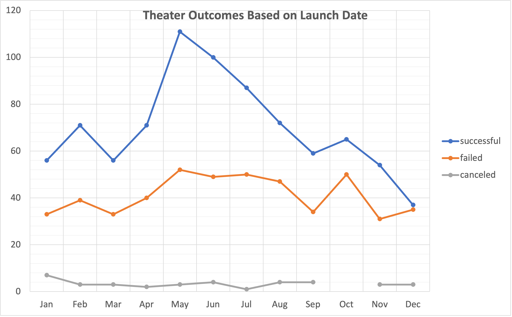
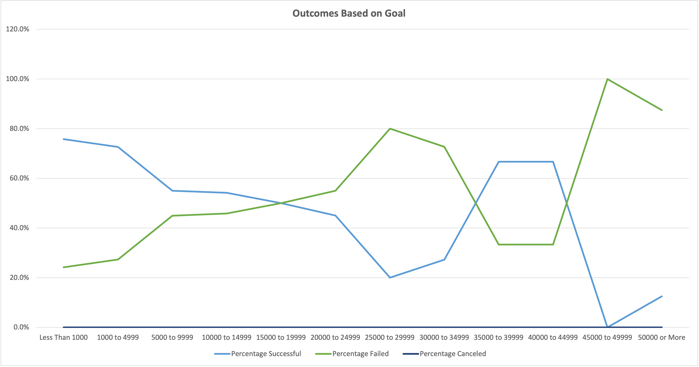

# Kickstarting with Excel

## Overview of Project

### Purpose

The purpose of this analysis is to see how different Kickstarter campaigns in the Theater category fared based on their launch dates and how the subcategory of plays fared based on their funding goals.

## Analysis and Challenges

### Analysis of Outcomes Based on Launch Date
Since only completed outcomes of theater campaigns were of interest, only successful, failed, and canceled outcomes were reviewed. Live campaigns were omitted. Overall, there are more successful campaigns than failed or canceled.

### Analysis of Outcomes Based on Goals
The analysis of outcomes based on goals focused on the subcategory of plays that were successful, failed, or canceled. As seen in the graph below, no play campaigns were canceled. When the campaign goal was between $1,500 to $19,999, 50% of play campaigns failed and 50% were successful. Overall, more campaigns were successful when the goal was a lower amount.

### Challenges and Difficulties Encountered
A difficulty I encountered was with the Outcomes Based on Goals graph. My initial graph did not look right. After further evaluation, I discovered it was because I was missing the $35,000 to $39,999 goal amount, which left out some data points.

## Results

###### Conclusions Based on Launch Dates
We can conclude the following based on the theater campaigns' launch dates:
1. Theater Kickstarter campaigns that launch between May and July are more likely to be successful.
2. Theater Kickstarter campaigns that launch between November and December are more likely to fail.

###### Conclusions Based on Goal
Based on fundraising goals, we can conclude that Kickstarter campaigns in the plays subcategory that have a low goal amount are more likely to be successful than play campaigns with a high goal amount.

###### Limitations
Some limitations of this data set are listed below:
1. This data set does not indicate if campaigns were advertised on outside platforms such as social media. This data could potentially shed light on whether more visibility on other platforms has an effect on a campaign's success.
2. To incentivise donations, campaigns typically offer rewards based on the amount donated. This data set does not include reward information.

###### Graph Suggestions
Other graphs that can be created:
1. A bar graph that compares outcomes of a theater campaign based on whether or not they have a spotlight.
2. A bar graph comparing theater campaigns between countries to illustrate whether there is a significant difference in outcomes.
3. A line graph to show how the amount of campaigns in each category has increased or decreased over the years.