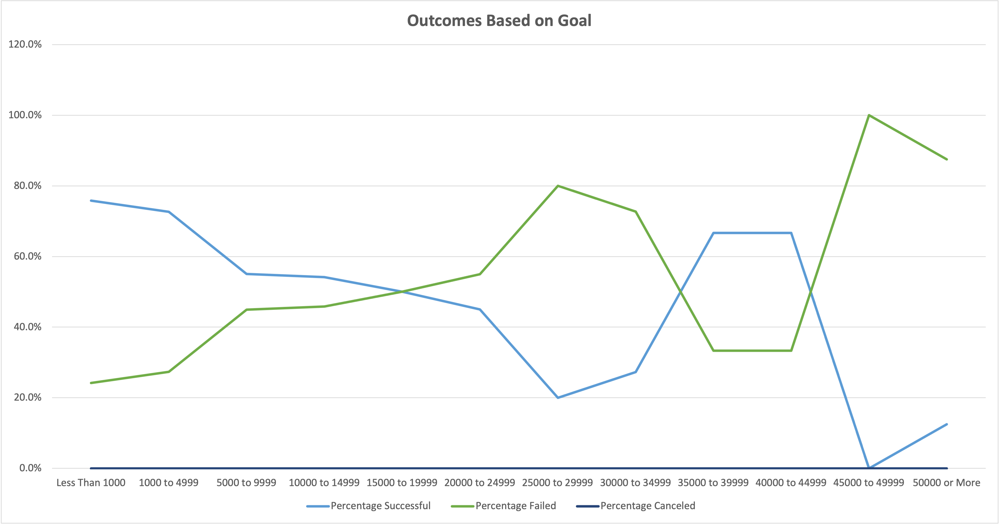

# Kickstarting with Excel

## Overview of Project

### Purpose

- The purpose of this analysis is to see how different Kickstarter campaigns in the Theater category fared based on their launch dates and how the subcategory of plays fared based on their funding goals.

## Analysis and Challenges

### Analysis of Outcomes Based on Launch Date
- As we wanted to review completed outcomes of theater campaigns, we compared successful, failed, and canceled outcomes and omitted live campaigns.

### Analysis of Outcomes Based on Goals

### Challenges and Difficulties Encountered

## Results

- We can conclude the following based on the theater campaigns' launch dates:
  1) Theater Kickstarter campaigns that launch between May and July are more likely to be successful
  2) Theater Kickstarter campaigns that launch between November and December are more likely to fail.

- Based on fundraising goals, we can conclude that Kickstarter campaigns in the plays subcategory that have a low Goal amount are more likely to be successful than play campaigns with a high goal amount.

- What are some limitations of this dataset?

- What are some other possible tables and/or graphs that we could create?
